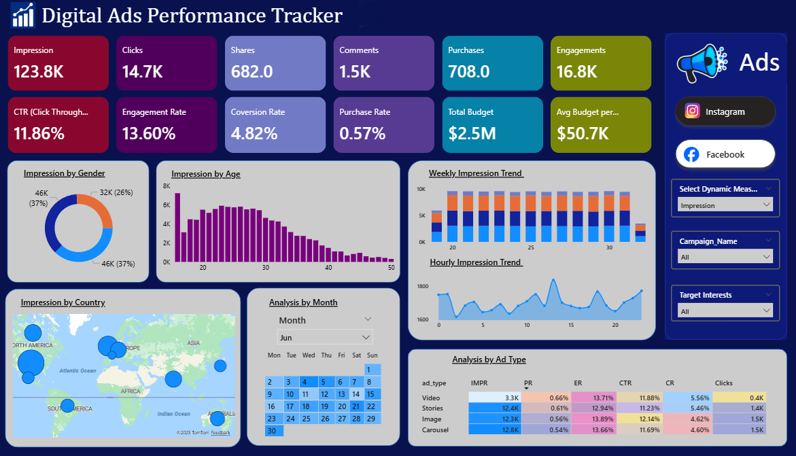

# Digital Ads Performance Tracker (Power BI)

This Power BI dashboard provides a complete performance overview of digital marketing campaigns across platforms. It helps marketing teams evaluate campaign efficiency, audience engagement, and budget utilization to make data-driven optimization decisions.

---
# Digital Ads Performance Tracker (Power BI)

This Power BI dashboard provides a complete performance overview of digital marketing campaigns across platforms. It helps marketing teams evaluate campaign efficiency, audience engagement, and budget utilization to make data-driven optimization decisions.

---

## 📊 Dashboard Preview

> Main Overview Dashboard


---

## 🚀 Key Features
- **Cross-platform performance tracking** (Instagram, Facebook, YouTube, etc.)
- **Centralized KPIs:** Impressions, Clicks, CTR, Engagement Rate, Conversion Rate, Purchase Rate
- **Audience Insights:** By gender, age, interest group, and geography
- **Time-based Trend Analysis:** Weekly and hourly performance visualization
- **Ad Format Comparison:** Performance of video, stories, image, and carousel ads
- **Interactive Filters:** Campaign, platform, target interests, and metrics selector

---

## 🛠️ Tools & Technologies Used
| Component | Purpose |
|---------|---------|
| **Power BI** | Dashboard creation & visual analytics |
| **Power Query** | Data cleaning & transformation |
| **DAX** | Measure calculations & KPI logic |
| **Excel / CSV Data** | Source dataset |

---

## 🔍 Insights the Dashboard Helps Reveal
- Which ad platforms generate the highest engagement and conversions
- Which audience segments respond best to campaigns
- What times/days drive the highest activity
- Which ad formats are most cost-effective
- Where budget can be reallocated for improved ROI

---

## 🧠 Example DAX Measures
```DAX
CTR = DIVIDE(Clicks, Impressions)
Engagement Rate = DIVIDE(Engagements, Impressions)
CPC = DIVIDE(Spend, Clicks)
Conversion Rate = DIVIDE(Purchases, Clicks)

## 📊 Dashboard Preview

> Main Overview Dashboard



---

## 🚀 Key Features
- **Cross-platform performance tracking** (Instagram, Facebook, YouTube, etc.)
- **Centralized KPIs:** Impressions, Clicks, CTR, Engagement Rate, Conversion Rate, Purchase Rate
- **Audience Insights:** By gender, age, interest group, and geography
- **Time-based Trend Analysis:** Weekly and hourly performance visualization
- **Ad Format Comparison:** Performance of video, stories, image, and carousel ads
- **Interactive Filters:** Campaign, platform, target interests, and metrics selector

---

## 🛠️ Tools & Technologies Used
| Component | Purpose |
|---------|---------|
| **Power BI** | Dashboard creation & visual analytics |
| **Power Query** | Data cleaning & transformation |
| **DAX** | Measure calculations & KPI logic |
| **Excel / CSV Data** | Source dataset |

---

## 🔍 Insights the Dashboard Helps Reveal
- Which ad platforms generate the highest engagement and conversions
- Which audience segments respond best to campaigns
- What times/days drive the highest activity
- Which ad formats are most cost-effective
- Where budget can be reallocated for improved ROI

---

## 🧠 Example DAX Measures
```DAX
CTR = DIVIDE(Clicks, Impressions)
Engagement Rate = DIVIDE(Engagements, Impressions)
CPC = DIVIDE(Spend, Clicks)
Conversion Rate = DIVIDE(Purchases, Clicks)
